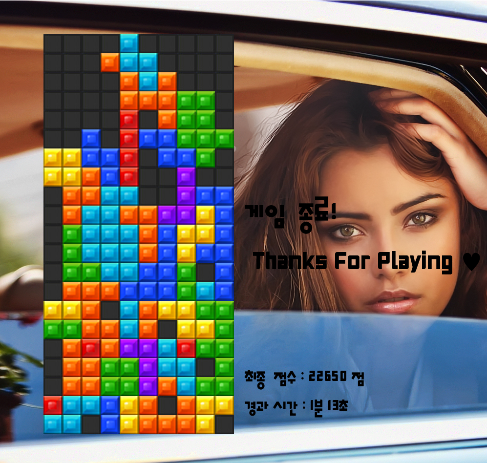

<h2>Outline</h2>

[](https://www.codacy.com?utm_source=github.com&amp;utm_medium=referral&amp;utm_content=jopemachine/Tetris-SFML&amp;utm_campaign=Badge_Grade)

SFML 학습용으로 진행했던 개인 프로젝트

<h2>Development Environment</h2>

> Windows 10 
>
> SFML 2.5.1
>
> Visual Studio 2017


<h2>Game Manual</h2>

```
방향키 : 블럭 조정
스페이스바 : 블럭 바로 내리기
```


<h2>Asset Sources</h2>

게임 중 랜덤으로 나오는 배경화면 파일들은 인터넷에서 다운로드 받은 것을 넣었다.

블록의 이미지 파일은 구글에 검색해 나온 블럭 파일을 색깔 별로 한 개씩 잘라 이미지로 사용했다.

폰트 파일은 무료로 배포하던 고도 마음체, 나눔 고딕체, tvNBold체를 사용했고

효과음 파일은 http://sound.0-w-0.com/apps/effect/effect_kr.asp?pCategory=1 에서,

배경음악 파일은 https://www.bensound.com/ 에서 다운로드 받아 사용했다.


<h2>Screen shot</h2>




